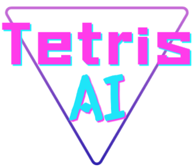
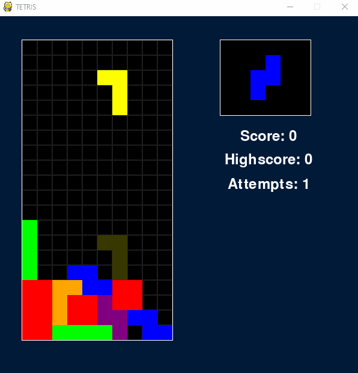
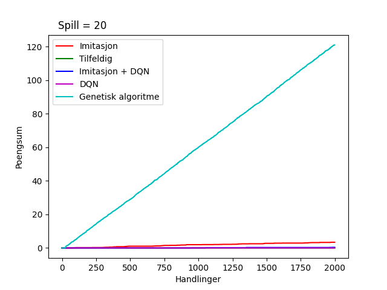
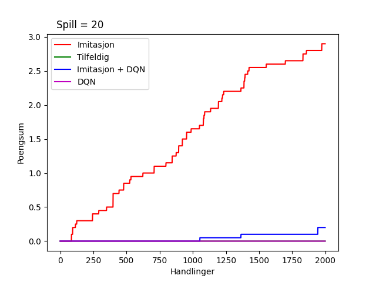

<p align="center">
  
</p>




## Genetic algorithm vs Imitation + DQN

<p align="center">
  
  
</p>

# Usage

`main.py` for playing Tetris manually.

`main_dqn.py` for training and testing DQN.

`main_imitation.py` for training and data collection Imitation learning.

`main_natselect.py` for training and testing Natural Selection

`benchmark.py` for comparing agents.

# Install

> pip install -r requirements.txt

and <a href="https://pytorch.org/" target="_blank">Pytorch</a>

# Config

To edit Tetris behaviour change contructor params.

```py
env = Tetris({
  'reduced_shapes': True,
  'reduced_grid': True
})
```
