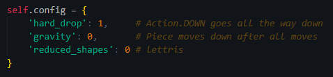
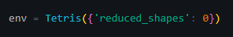
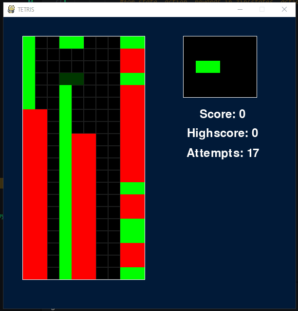

# Uke 44

# Veileder møte

Møte med Jonathan 27.10.

Snakket om hva slags reinforcement learning vi burde fokusere på fremover.

- Imitation Learning
    - Lærer på vår spilling
- Deep Q Learning
    - Utforsker spilling selv
    - Kan fores på imitation learning vekter

En stor ulempe med DQN er tiden det tar å trene.

Derfor skal vi implementere en letter versjon av Tetris slik at vi kan sjekke modellen med kortere trening.

# Enviorment

Implementerte config slik at det er enkelt å endre på ting

I Tetris klassen

I main

# AI: DQN

Uten riktige vekter ser man fort at den spiller feil.

Dersom den blir straffet for å lage dype hull blir den bedre.

# AI: Imitation

# AI: Natural selection

Løste mange problemer som hadde med utregning av verdier for valg av beste move å gjøre.
Likevel er det fortsatt noen problemer. 
Har også prøvd litt andre verdier men det er fortsatt en eller flere bugs som ødelegger valg av move.

