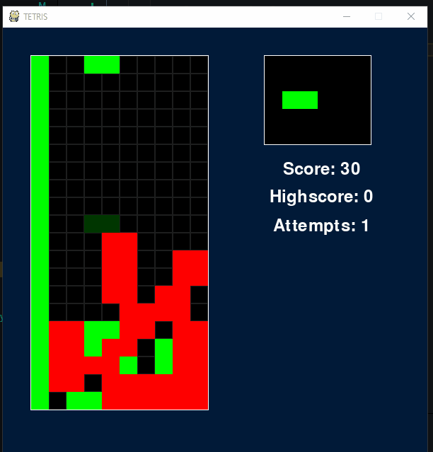

# Uke 45

# Veileder møte

* Samme nettverk i DQN og Imitation
* Blokken må gå ned automatisk etter en hvis tid
* Kjøre samme rekkefølge av brikker
* Parrallellprossesering
* Leke med parameterene i nat-select
* Begynne på rapport

# Enviorment

Implementert metoder for å lagre state slik at agentene kan simulere trekk.

```py
checkpoint = env.save_checkpoint()

# do stuff

env.load_checkpoint(checkpoint)

```

Enviorment gjør om game state til obervasjon.

Observasjonen har formen `(2, (20, 10))`

Det består av 2 lag, et statisk lag med alle plasserte brikker, og et dynamisk lag med brikken som blir flyttet på.

# AI: DQN

For å trene det nevrale nettverket lager vi en replay buffer hvor man kan hente ut tidligere trekk

```py
batch = self.memory.sample(batch_size)

for state, action, next_state, reward in batch:
    
    # learn
```

Modifiserer NN med resize

```py
self.q_net = nn.Sequential(
    nn.Conv2d(2, 32, (20, 10)),
    nn.ReLU(),
    nn.Conv2d(32, 64, (1, 1)),
    nn.ReLU(),
    Resize(-1, 64),
    nn.Linear(64, env.action_space)
)
```

# AI: Imitation

Fikk satt opp et nettverk som kjørte og trente. Fikk problem med at den satt seg fast enten helt til høyre eller helt til venstre. Men etter veileder møtet, la vi inn at den gikk ned av seg selv, og da ble det fikset. Måtte da skaffe ny data å trene på. Så blir det å utforske litt på learning rate og få den til å spele.

# AI: Genetisk algoritme

Tok i bruk kode som ble brukt for environment for å lagre og laste inn "checkpoints".
Det erstattet mye av min kode og ser som det også løste mine bugs. Dermed var det bugs i henting av alle mulig trekk.

Jeg kjørte noen tester med 100 startkandidater som etter bare 17 generasjoner fikk de en gjennomsnittlig score på 80 som er veldig bra.



Etter ~60 epoker hadde jeg vekter som ble ganske greit. De fikk 300 highscore på tetris og mer enn tusen på lettris.

Jeg la inn kode for å kjøre trening av kandidater i threads basert på antall kjerner siden vi kanskje får tilgang til AI Lab.
Fikk også nytte av det for firekjerners prosessoren på våre maskiner. 
