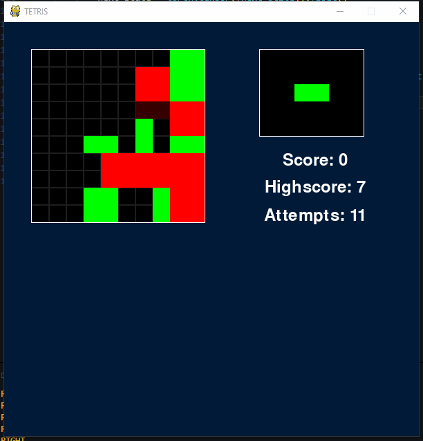
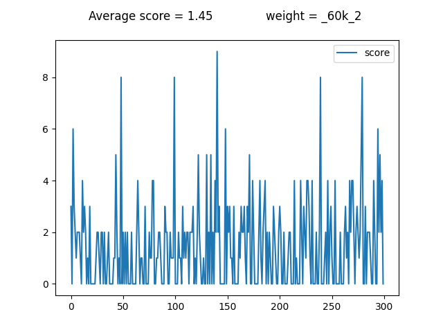

# Uke 46

# Veileder møte

- Test med mindre spillområde
- Gjennomgang av kode

# Enviorment

Implementerte mindre spillområde som kan aktiveres via config i konstruktør

```py
env = Tetris({
    'reduced_shapes': 1,
    'reduced_grid': 1
})
```

# AI: DQN

Etter å ha trent modellen med 60k epocher på fullt spillområdet og reduserte brikker ser den slik ut.


<br><sup><sub>Video ble skurrete av ffmpeg konversjon</sub></sup>

Utvider nettet.
Ser også på hvordan ReLU sammenlignes med LeakyReLU

```py
self.q_net = nn.Sequential(
    nn.Conv2d(2, 32, 3),
    nn.ReLU(),
    nn.MaxPool2d(2, 2),
    nn.Conv2d(32, 64, 3),
    nn.ReLU(),
    nn.MaxPool2d(2, 2),
    Resize(-1, resize_to),
    nn.Linear(dense_shape, 64),
    nn.ReLU(),
    nn.Linear(64, env.action_space),
    nn.ReLU()
)
```

Bytter ut ReLU med LeakyReLU og trener med 'reduced_grid'



Benchmark:




# Imitation

Endret nettverket til akkurat det samme som DQN brukte i starten av uken. Så trening og testing. I slutten av uken endret nettverket seg fra ReLu til LeakyReLU, så da ble det enda mer trening og testing. 
