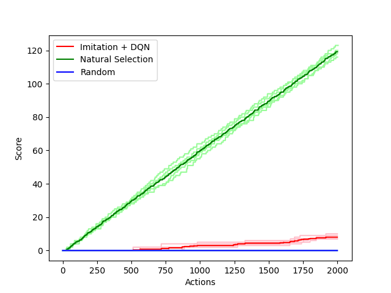
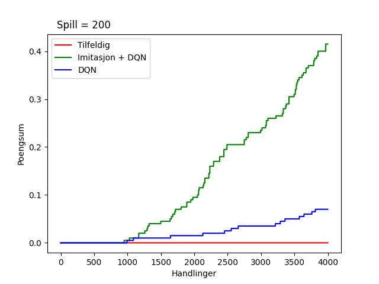

# Uke 47

Siste uke før innlevering.

Ba om å få tilgang til NTNU maskin for trening da det tar flere timer å kjøre trening lokalt. Sendte mail den 4.nov og ble lagt til i systemet den 19.nov. Vi får desverre fortsatt ikke logget inn, det gjenstår en den kombinasjoner av parametre vi vil prøve.

# Veileder møte

Gikk igjennom rapporten. Fikk tilbake melding på struktur og ordbruk.

# Benchmarking

Lager script for å sammenligne de forskjellige agentene over n actions.
Tester også random for å vise tydelig læring for DQN

# Imitation

Startet uken med å endre til å bruke batches ved trening, siden vi begynte å få mye data. Senere i uken ble det oppdaget en feil ved trening, og måtte trene på nytt. 

# DQN

Sliter mye med trening, sammenligner forskjellige treningsmetodet for dqn

